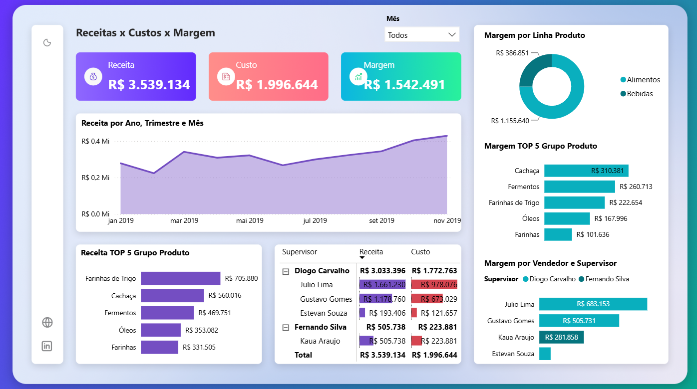

# 📊 Dashboard de Receitas, Custos e Margem — Power BI

## 🎯 Objetivo do projeto

Este projeto foi desenvolvido durante um **minicurso da Xperiun**, com o objetivo de praticar conceitos de análise e visualização de dados utilizando o Power BI.

A partir de uma base de dados estruturada em Excel, foi desenvolvido um dashboard para analisar indicadores de receita, custos e margem, permitindo uma visão geral dos resultados e do desempenho por diferentes categorias.

## 🛠️ Tecnologias utilizadas

- **Microsoft Excel** — utilizado como base de dados;
- **Power BI** — utilizado para análise, modelagem e criação do dashboard.

## 📊 Análises realizadas

O dashboard apresenta análises relacionadas a:

- Receita;
- Custos;
- Margem;
- Receita por ano, trimestre e mês;
- Margem por linha de produto;
- Receita dos principais grupos de produtos;
- Margem dos principais grupos de produtos;
- Receita e custo por vendedor e supervisor;
- Desempenho por período.

## 📈 Dashboard

## 📚 O que aprendi

Durante o desenvolvimento deste projeto, pude praticar:

- Utilização de uma base de dados estruturada em Excel;
- Importação e organização de dados no Power BI;
- Modelagem de dados;
- Criação de indicadores e métricas;
- Construção de gráficos e visualizações;
- Criação de dashboards interativos;
- Utilização de filtros e segmentações;
- Análise de receita, custos e margem;
- Organização das informações para facilitar a interpretação dos dados.

## 🎓 Curso

Projeto desenvolvido durante um **minicurso da Xperiun**, como parte do meu processo de aprendizado e desenvolvimento de habilidades em Power BI e análise de dados.

## 🚀 Próximos passos

Continuar aprimorando meus conhecimentos na área de Dados, estudando:

- SQL;
- Python;
- DAX;
- Modelagem de dados;
- Business Intelligence;
- Análise e visualização de dados.

## 👩‍💻 Sobre mim

Sou estudante de **Análise e Desenvolvimento de Sistemas** e tenho interesse em construir minha carreira na área de **Dados e Business Intelligence**.

Atualmente, estou desenvolvendo meus conhecimentos em Excel e Power BI e utilizando projetos acadêmicos e de cursos para construir meu portfólio e colocar meus aprendizados em prática.
